# Practica 1

#### Introducción 
Esta práctica tiene como objetivo que usemos distintas herramientas para recuperar informacion y para introducirnos en ***Análisis Forense***


#### Escenario / Problema

Avui és 15 de setembre de 2004. L'hora són les 3:15 PM. El senyor Jim Boss, el
propietari de la Really Big Company, et truca per a què vagis a la seva oficina. El
senyor Boss et comenta que sospita que la seva assistent, Emma Crook, estava
proporcionant material sensible de l'empresa a alguns dels seus competidors. A les
2:00 PM, avui truca a la Sra Crook i li comenta les seves sospites. Li diu que
tornaria a les 3:00 PM per a una explicació. Quan el senyor Boss torna a l'oficina de
la Sra. Crook a les 3:00 PM, ella no hi és, i ha buidat el despatx de totes les seves
pertinences. El senyor Boss intenta encendre l'ordinador de la senyora Crook, però no
arrenca. Examinant l’habitació, troba un disquet a la paperera. El senyor Boss

t’entrega el disquet i vol que li expliquis exactament el que la Sra. Crook estava
fent. El primer que fas es comprovar l’ordinador, i trobes que li falta el disc dur.
Així doncs, l’única prova que tenim és un disquet. Un cop ja al teu despatx,
introdueixes el disquet i descobreixes que no hi ha res, és a dir, l’han formatejat.
Fas una còpia del mateix i obtens un fitxer **RAW** amb el què treballaràs.
1. Documenta i descriu tot el procés de la teva investigació (amb captures de
pantalla, comentant tots els passos seguits).


#### WINDOWS 
***Autopsy***
En la parte de Windows usaremos una herramienta llamada ***Autopsy*** usada para el análisis forense y recuperación de datos. 
Empezaremos con la instalación de la herramienta.  

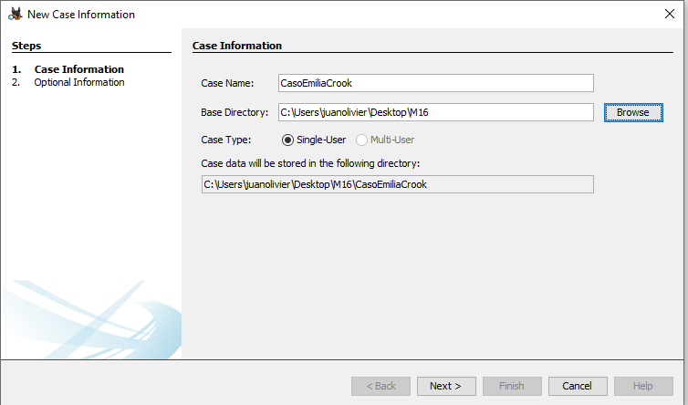

Para el nuevo caso usaremos el disco que hemos descargado de la práctica.

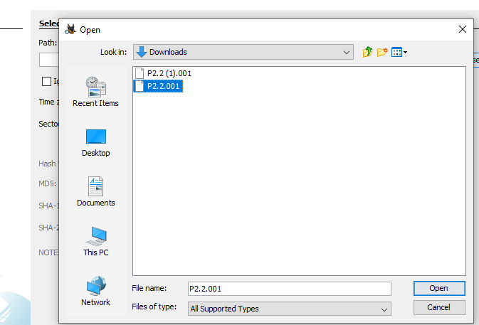

Una vez escogido el disco ejecutamos el programa.

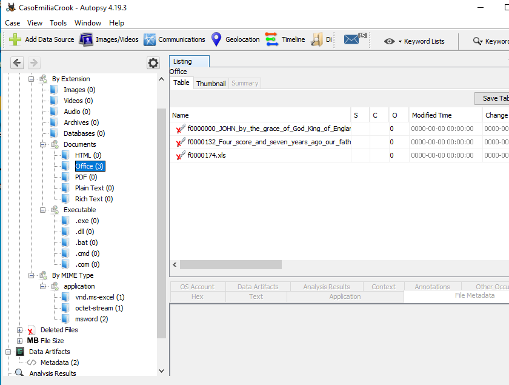

Como se puede ver en la imagen anterior con el programa Autopsy hemos sacado varios archivos donde podemos ver evidencias del delito.

#### KALI

***Foremost***

Ponemos el disco en el directorio de trabajo. 

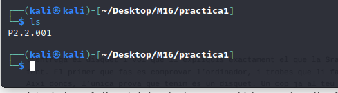


Y empezamos con la extracción de información del disquete con la herramienta foremost.
La información extraída es un archivo "-txt" y un direcotrio.

```sh
foremost disco
```

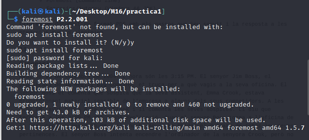

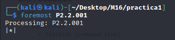

```sh
cat audit.txt
```

Hacemos un cat del archivo de texto y nos muestra la información a modo de resumen de lo que hay dentro del disco y de lo que hemos extraído.
Seguidamente entramos al directorio que hemos conseguido de la extraccíon del disco. Y encontramos 4 archivos .ole los cuales analizaremos con la herramienta Exiftool.

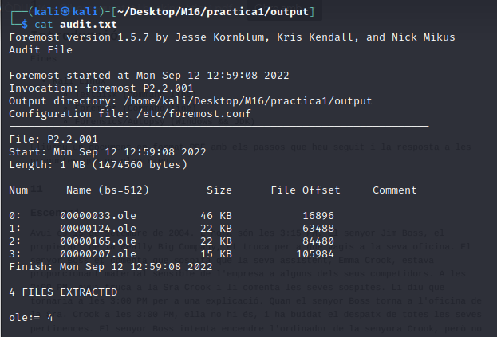

***Testdisk***
A la hora de realizar la práctica he encontrado varios problemas con el testdisk que te hemos comentado toda la clase y no hemos conseguido nada con esta herramienta.

***Exiftool***
Exiftool es una herramienta de analisis que usaremos para que nos muestre por pantalla la inforamción de los archivos .ole que hemos conseguido gracias a la extracción de la herramienta anterior.

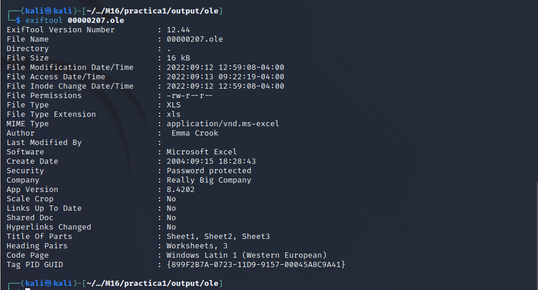

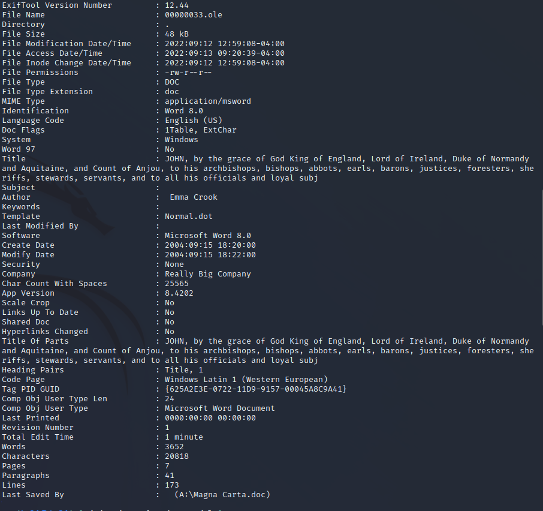

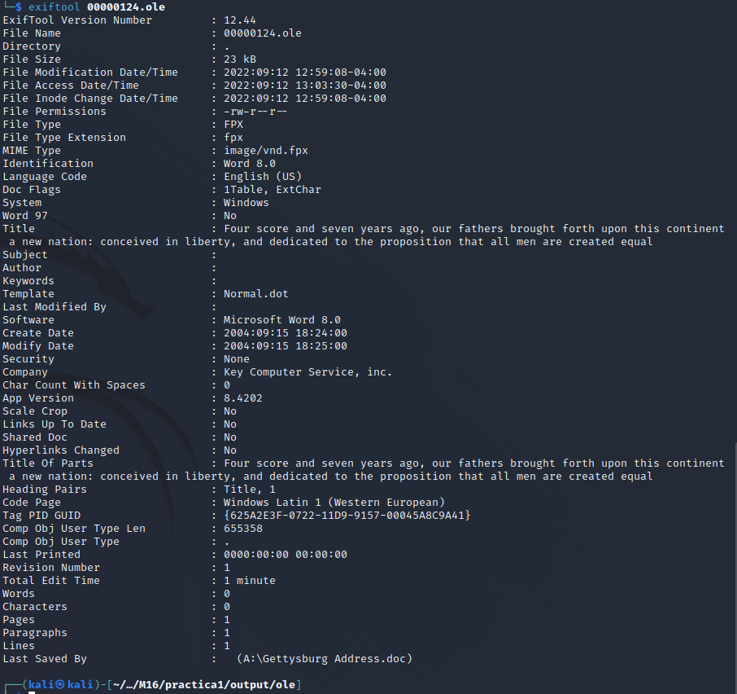

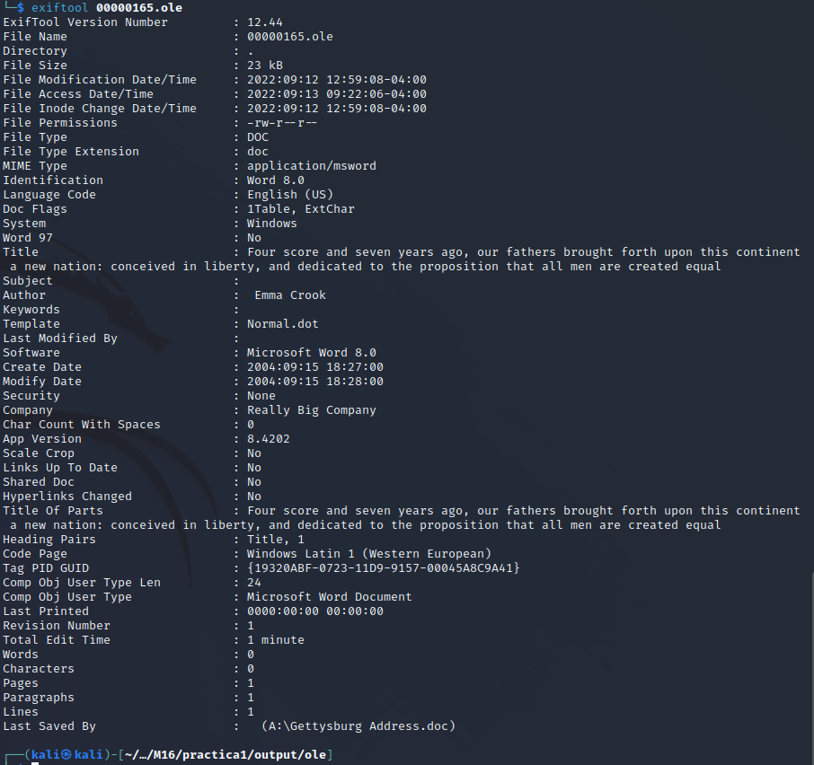

Gracias al analisis de esta herramienta podemos ver que los archivos son de tipo Office por lo tanto hemos de instalarnos la herramienta libreoffice con el siguiente comando.

```sh
sudo apt-get update & upgrade
```
Este comando lo usaremos para actualizar el sistema y poder instalar la herramienta que necesitamos

```sh
sudo apt install libreoffice
```
Con esto instalaremos la herramienta.

```sh
libreoffice archivo
```
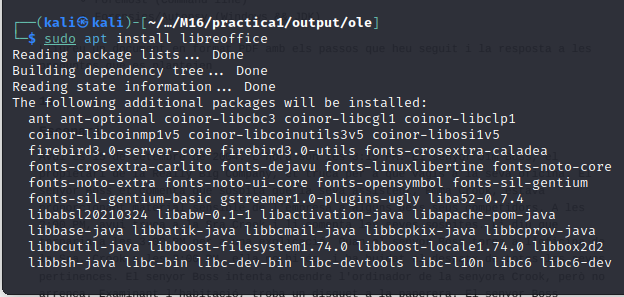

Al usar la herramienta podemos ver 3 archivos los cuales no tienen importancia pero hay uno que esta guardado con contraseña.
Para poder entrar al archivo usaremos una herramienta de fuerza bruta llamada John the Ripper por lo tanto procederemos con la instalación.

```sh
https://andreafortuna.org/2019/03/20/cracking-microsoft-excel-documents-using-john-the-ripper/
```
Aqui dejo el link de la instalación para burlar contrasñas en Microsoft Excel con john.

Una vez instalado procedemos a usar el comando para la contraseña.

```sh
john --rules --wordlist=PATH/rockyou.txt hash.txt
```
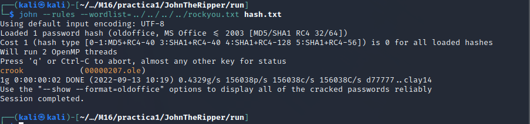
En el comando vemos rockyou.txt que es el diccionario que usamos para intentar que la herramienta pete la contraseña.

Al entrar al documento vemos la evidencia clara que Emilia Crook ha pasado información a la competencia.

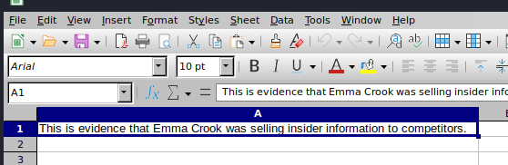


